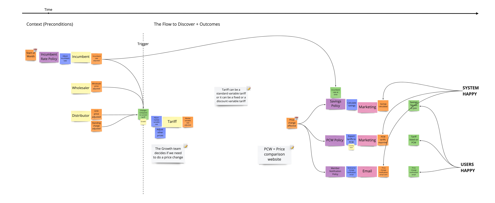

# Reactive Core Application Design Prototype

## Overview

This is a prototype application based on Hexagonal architecture with
a reactive, event-driven core. The application demonstrates how a
domain-oriented microservice can utilise domain events to drive internal
workflows within the service.

The application aligns with a sales/growth domain whose function it is
to compute and broadcast changes to product pricing based on the market
variable rate of energy usage. The process model below not production-ready
and is simply intended for educational purposes:




## Development

Recommended tooling:

* [pyenv](https://github.com/pyenv/pyenv#installation)
* [poetry](https://python-poetry.org/docs/#installation)

Install Python 3.9.5 and set it as local pyenv version:

```
pyenv install 3.9.5
pyenv local 3.9.5
```

Install Python packages:

```
poetry install
```

This project also uses pre-commit to run linters and formatters.
It is already installed in the dev dependencies, you just need to activate it:

```
poetry run pre-commit install
```


### Extra Stuff

To activate Python venv:

```
poetry shell
```

To start a iPython console:

```
poetry run ipython
```

To run mypy type checker:

```
mypy growth
```
